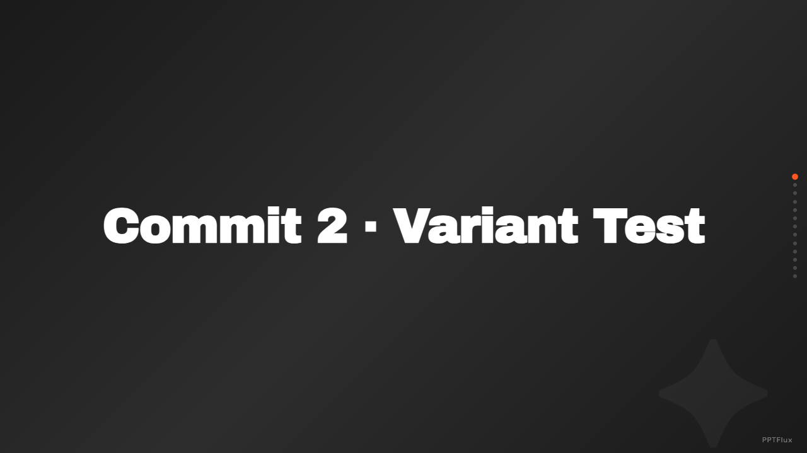
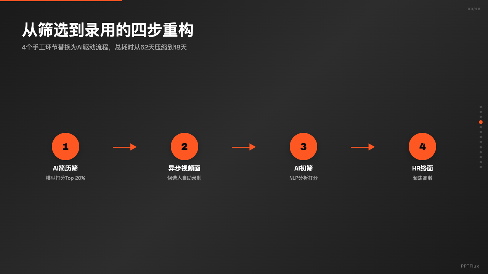
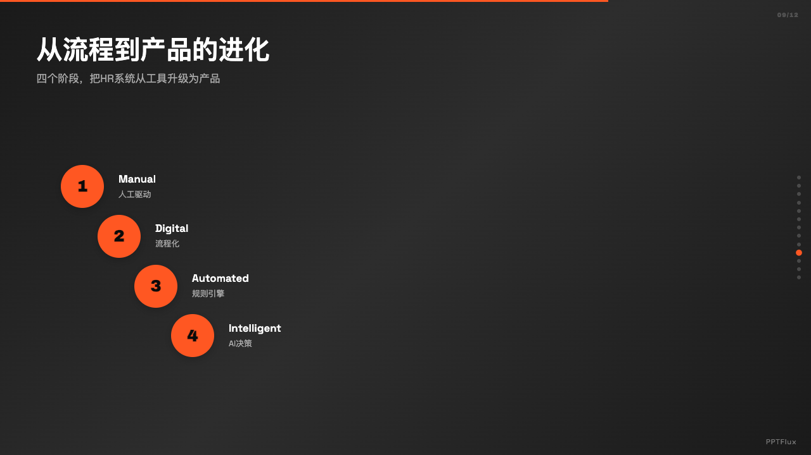

# PPTFlux

一个超级个体用 4 周时间端到端写的 AI PPT 工具。

输入资料 → AI 自动生成结构化、有设计语言的 12-15 页演示文稿。

🔗 **在线 demo**:[wilingna.github.io/pptflux](https://wilingna.github.io/pptflux/)

---

## 这是什么

PPTFlux 是一个纯前端单文件 HTML 的 AI PPT 生成工具。输入资料 + 主题,4 个 AI Agent 流水线接力(资料理解 → 结构大纲 → 内容表达 → HTML 渲染),生成一套 12-15 页的演示文稿。

不依赖后端,所有数据本地处理。用户填自己的 OpenRouter API Key 即可使用。

---

## 设计理念

- **每页布局完全不同**:6 个 layout × 3 个 variant 共 18 种内容排版,相邻页绝不重样
- **6 套视觉风格**:Bold Signal / Dark Botanical / Creative Voltage / Swiss Modern / Electric Studio / Notebook Tabs
- **4 Agent 自动化**:不是单一 prompt,是分阶段约束 + 后处理兜底,保证产出稳定

---

## 截图

### 标题页(Bold Signal)

### dataV2 — 巨型数字布局

### processV3 — 横向流程图

### processV3 — 阶梯进化

### insightV1 — 大引号编辑式排版

> 更多风格示例见 [`docs/screenshots/`](docs/screenshots/)

---

## 使用

1. 克隆仓库 / 访问 [GitHub Pages 在线 demo](https://wilingna.github.io/pptflux/)
2. 在设置里填入你的 OpenRouter API Key
3. 选择风格、填资料、生成

需要 Claude Opus 4 或 Sonnet 4 模型,推荐通过 [OpenRouter](https://openrouter.ai/) 接入。

---

## 技术栈

- 单文件 HTML + Vanilla JS,无构建,无依赖
- OpenRouter API gateway
- Claude Opus / Sonnet 模型

---

## 为什么写这个

我是一个超级个体创作者,做 AI 工作流方向。这个项目是我个人的"超级个体作品集"之一 —— 想验证一件事:作为一个人,能不能用 4 周时间端到端做出一个有产品感、有设计语言、能稳定输出的 AI 工具。

这不是一个商业产品。我不打算做付费版,也不打算做用户运营。它只是一份"超级个体能做到什么"的证明。

开发过程的复盘文章正在写,写完会更新链接。

---

## 协议

[MIT License](LICENSE) — 随便用,做衍生项目不用问。

---

## 关于作者

**Halina** ([@wilingna](https://github.com/wilingna)),超级个体创作者,做 AI 工作流 / 中国传统美学数字文化出海。

- 小红书 / 视频号 / B 站 / 抖音:_后续补充_
- 另一个项目:[zengen.art](https://zengen.art)(中国神话美学剪纸 DIY 出海)
